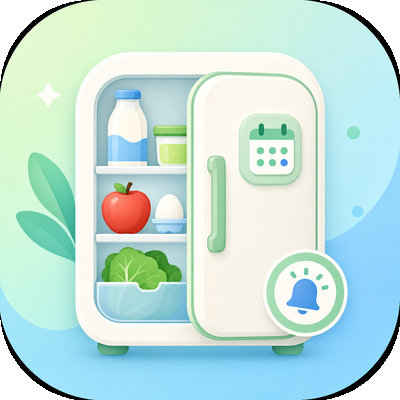
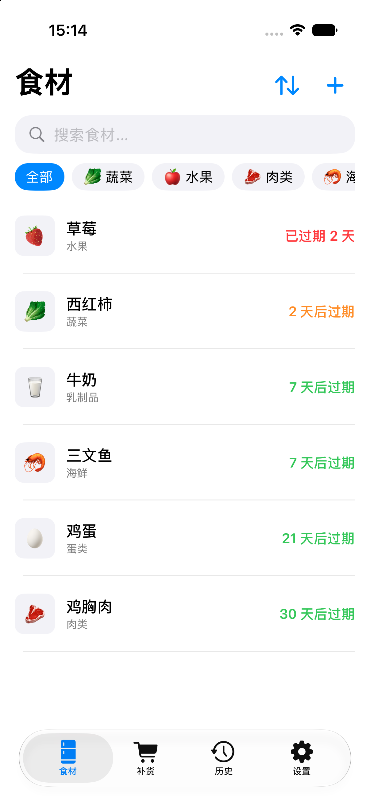
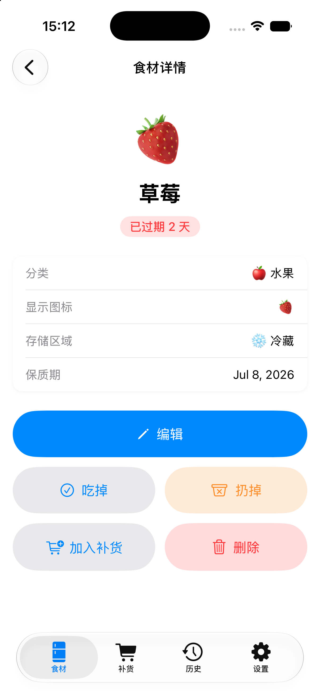
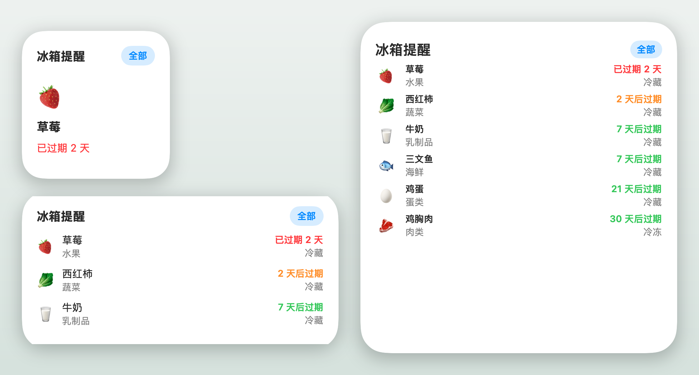

# FridgeTracker

追踪冰箱里每样食材的保质期，临期本地推送提醒，桌面 Widget 实时显示临期清单。

完全本地运行，无后端、无账号、无网络请求，数据只存在设备上。

FridgeTracker 是一个 iOS SwiftUI app：录入食材、按分类和存放区（冷藏/冷冻/常温）管理，临近过期时推送本地通知。内置一条辅助闭环：拍照识别包装上的日期文字，一键把识别结果转成补货项，消耗或丢弃食材时记一笔处置记录，再从这些历史记录里生成下一轮的补货建议。

## 界面预览

<table>
  <tr>
    <td width="50%"></td>
    <td width="50%"></td>
  </tr>
  <tr>
    <td align="center"><b>食材管理</b> 按分类与存放区管理，列表按到期排序，红/橙/绿标示状态</td>
    <td align="center"><b>过期提醒</b> 详情页显示到期状态，临期与到期当天推送本地通知</td>
  </tr>
</table>

**桌面 Widget** — 小 / 中 / 大三种尺寸，实时显示临期清单，点击深链到对应食材：

## 功能

- **食材管理**：按分类（肉/海鲜/蔬果/乳蛋/冷冻…）和存放区（冷藏/冷冻/常温）录入与管理，列表支持搜索、分类、按到期排序。
- **过期提醒**：临期与到期当天推送本地通知；分类默认提前天数可调（肉/海鲜 2 天、冷冻 7 天等）。系统通知被拒时设置页给出恢复入口。
- **桌面 Widget**：小/中/大三种尺寸实时显示临期清单，点击深链到对应食材；支持 Dynamic Type 与 VoiceOver。
- **拍照识别日期**：Vision 端上 OCR 识别包装上的生产/保质日期，一键转成补货项。
- **消耗闭环**：消耗或丢弃时按品类用「吃/喝/用」记处置，历史记录再生成下一轮补货建议。

## 技术栈

iOS 26+ / SwiftUI，持久化用 SwiftData，桌面组件用 WidgetKit，本地提醒用 UserNotifications，端上 OCR 用 Vision。主 app 与 Widget 通过 App Group 共享数据。

## 安装

[Releases](https://github.com/congee949/FridgeTracker/releases) 里提供**未签名 IPA**（`FridgeTracker-x.y.z-unsigned.ipa`），不绑定任何设备/账号，需用**你自己的 Apple ID** 侧载。
